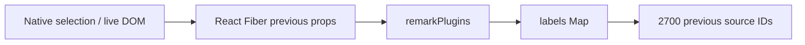

# 2026-09-29：Frontend 記憶體修復及核對

這是較早的修復前後配對及 10 分鐘結果。後續補上逐 record 查詢、完成段落展示合併、loading／Mermaid 延後載入，並把長測改為使用者指定的一小時；新證據及限制見 [Week 3 一小時驗收](week3-one-hour-validation.zh-HK.md)。本文件保留原配對數值，未把新 build 冒充舊配對。

本輪優先處理 frontend 記憶體。已修復能重現的 Mermaid DOM 累積、session 切換後的引用索引殘留及反覆配置成本；修正實際捲動容器，補上 wheel／live tail 驗證。沒有 commit／push、改 DB、讀寫 `.env`、新增 provider／音訊上傳或重啟 live API。先前 notes／Jev 重構 WIP 保留。

## 找到甚麼、如何修復

| 路徑 | 修復前證據 | 目前處理 |
|---|---|---|
| 未完成／錯誤 Mermaid | 同一 browser 中 10／20／30 次不同 partial diagram，各留下 10／20／30 個 `body > div#ddiagram-*`；強制 GC 仍存在。已安裝 Mermaid 的 `render()` 在 parse error 分支會先 throw，跳過清理。 | [diagramRenderer.ts](../app-temp/web/src/Component/diagramRenderer.ts) 使用每次請求自有 host，`finally` 移除；關閉 Mermaid error rendering。去重、單一 render、取消尚未開始且無讀者的工作。cache 最多 32 項及 2 MiB，失敗只保存小標記，不保存 Error／DOM／parser graph；input 24,000 chars／output 1 MiB 上限。已開始的 Mermaid 工作仍不能硬取消。 |
| 小 session 仍留大筆記引用索引 | 小 session 的 heap snapshot 仍有全部 2,700 個 `memory-N` source ID；最短 strong path 經 native selection／live DOM → React Fiber previous props → remarkPlugins → labels Map。這是前一份資料保留，沒有把它說成每次必定新增一份的無限 leak。 | [NotesPanel](../app-temp/web/src/pages/NotesPanel.tsx)、[TranscriptPanel](../app-temp/web/src/pages/TranscriptPanel.tsx) 以 session identity 重建 NotePreview／TranscriptContent；小 session snapshot 舊 IDs 為 0。 |
| 收起的 history／changes 仍建整棵 DOM | 真實 100 版 edit logs 加 100 筆 execution fixture：打開 Activity 即掛載 9,620 個元素，未展開的 changes／source buttons 也已建立。 | [LazyDetails](../app-temp/web/src/Component/LazyDetails.tsx) 只在展開時建立 body，收起即卸載。Activity、note changes、edit history、term trace 採用；Activity 關閉移除整個內容，NoteTools 關閉亦清 state／取消讀取／卸載歷史與 recovery Markdown。這是 lazy detail bodies，**不冒稱 list virtualization**。 |
| 虛擬列表監聽錯容器 | 先前僅測 mounted rows 及程式 source reveal，沒有測真實 wheel。它監聽 `.transcript-view`，該層 `overflow:hidden`；實際捲動的是 `.transcript-content`。baseline wheel／live tail 無法正常掛載。 | [VirtualTranscript](../app-temp/web/src/pages/VirtualTranscript.tsx) 改用真實 scroll parent；resize anchor 不蓋過尚未進入 rAF 的使用者 scroll。新增原生 wheel、未被 confirmed ASR 覆蓋的 tail interim、來源跳轉、day collapse 及 viewport 檢查。 |
| interim 重建全堂 layout | Allocation sample 指向 TranscriptContent／VirtualTranscript：每次 interim 複製 day/hour 全列、建立 render closures、keys Set 及 offsets。 | [TranscriptContent](../app-temp/web/src/pages/TranscriptContent.tsx) 只在 confirmed data、collapse 或 live window 身份改變時重建；interim 文本由可見列讀當前 ref。穩定 reveal callback／索引，visible rows 仍會更新。原始 ASR／IDs 不合併或刪除。 |
| Activity／draft 反覆分配 | 90 秒 allocation sample 的熱點包括 `JSON.stringify(previous.items)`＋`JSON.stringify(items)`，以及每次 capture 建新 draft sources、重新解析 Markdown。 | [useActivity](../app-temp/web/src/pages/useActivity.ts) 逐 record 比較及重用未變物件，保存至多 100 筆 consumer metadata，省掉無用途的 promptText state；HTTP 仍可包含 prompt。draft sources、空 inputs 及計數有穩定 identity。 |
| 每 section 複製整堂引用 maps | 2,700 records／40 sections 配對：暖機 GC heap 約 18.93 MiB。 | [Markdown](../app-temp/web/src/Component/Markdown.tsx)、[NotePreview](../app-temp/web/src/pages/NotePreview.tsx) 共用一次 reference index；只索引筆記實際引用的資料，未引用的新 ASR 不讓 saved-note AST 失效。相同 fixture 暖機約 12.65 MiB，來源 alias／unknown／精確跳轉仍通過。 |
| 已完成請求的 timeout／旧讀取 | 舊 90 秒 snapshot 有 1,159 個 native AbortSignal；原 api helper 每次建立 150 秒 timeout，沒有自己的 dispose。Activity／capture／edit-history 關閉只忽略結果，沒有全部取消讀取。 | [api.ts](../app-temp/web/src/pages/api.ts) 的 controller／timer／abort listener 在 body 或 stream 完成後 dispose；相關 read effects 在關閉／卸載取消。仍保留 deadline 及逐 stream size 上限。 |
| 正在錄另一堂卻抓取全堂 | Capture finalize 以 recording session ID 呼叫 snapshot；若正在看小 session，最後才丟棄不匹配的 result，之前已 bootstrap 大資料。9 秒 fixture 有 129 個不必要的 sync 分頁請求（3 次全篇 bootstrap）。 | [handlers](../app-temp/web/src/pages/handlers.ts) 在讀取之前檢查目前 selected session；同一 navigation fixture 為 0 個不必要請求。capture level／狀態仍監察正在錄音的 session，返回該堂再載入最新資料。 |

實際 heap path 的簡化圖：



## 量測方法及配對結果

Windows、headless Edge **154.0.4258.37**、1440×1000、UTC。使用 Vite **production preview**，不是把較低 production heap 與前一輪 dev heap 直接比較。本輪 baseline 是修復前的 WIP web build `index-Qw53-Kaz.js`，隔離保存在 `web/output/memory-baseline-dist-20260929`、port 5176；初步修復 90 秒配對 build 為 `index-Bk72kTIx.js`。40-section／10 分鐘測試在 `index-DX0Ic6Pf.js` 上執行；其後另加入 unselected-recording early guard，最新 `index-B_8DLJe0.js` 的 navigation fixture 通過。沒有把前一個 build 的 10 分鐘證據說成最後一行改動亦跑過 10 分鐘。

所有 API 由 fixture 攔截；外部 host 封鎖，POST 被拒絕。737 transcripts／745 chunks 及 100 版 edit logs 取自 [原保存快照](../app-temp/data/validation/runs/2026-09-28-notes-retention-125936/session.json)。2,700 mic＋system records 代表三小時資料量；100 execution／prompt／streaming draft 是有標明的合成負載，不是新的真實 provider 執行。Interim 從最後 confirmed source 之後開始，每 250 ms 改動；每 4 秒增量加入兩個 sources 的 confirmed final。測 Edit／Preview、partial／valid diagrams、Live draft、Sources popup、session 切換。

GC 前後均記錄；一般 checkpoints 不強制 GC，每約一分鐘及 phase 邊界才回收。`heapAfter` 只有 `collected=true` 時才是強制 GC 後值。MiB = bytes / 1,048,576。數字是 JS used heap／DOM，**不是整個 Edge process working set**。

| 同一情境 | 修復前 | 修復後 |
|---|---|---|
| 737 saved snapshot idle DOM | 988 | 655 |
| Activity opened／collapsed histories DOM | 9,620 | 1,766 |
| 30 次 partial diagrams，GC 後殘留 containers | 30 | 0 |
| 90 秒結束後切小 session：mounted rows／DOM | 0／615 | 0／215 |
| 小 session heap 中舊 `memory-N` source IDs | 2,700 | 0 |
| 40 sections／2,700 records 暖機 GC heap | 18.93 MiB | 12.65 MiB |
| 90 秒 sampled allocations（估算，含已回收 objects） | 約 2.51 GB | 約 1.56 GB |
| 90 秒 CDP script time 增量 | 5.60 sec | 2.80 sec |

Allocation sample 約減 38%；它是抽樣估算，不是 exact bytes 或 leak rate。大量 Edit→Preview 故意反覆重建 AST，仍有正常的 allocation／GC。兩個 90 秒 run 均加入 44 個 final；baseline 捲動未能正確掛載尾段、fixed 則成功，所以 render 行為不同，CPU 比較只屬本 fixture 的有限證據。

配對原始資料：

- [baseline 90s](../app-temp/web/output/playwright/frontend-memory/baseline-paired/results.json)、[fixed 90s](../app-temp/web/output/playwright/frontend-memory/fixed-paired/results.json)。
- [baseline retained path](../app-temp/web/output/playwright/frontend-memory/baseline-paired/heap-analysis.json)、[fixed retained check](../app-temp/web/output/playwright/frontend-memory/fixed-paired/heap-analysis.json)。各 folder 另存 `.heapsnapshot`／allocation profile；heap snapshots 只作本機 artifact，不加入 Git。
- [40-section baseline](../app-temp/web/output/playwright/frontend-memory/baseline-40sections/results.json)、[40-section fixed](../app-temp/web/output/playwright/frontend-memory/fixed-40sections/results.json)。
- [navigation baseline](../app-temp/web/output/playwright/frontend-memory/baseline-navigation/results.json)、[navigation fixed](../app-temp/web/output/playwright/frontend-memory/fixed-navigation/results.json)。

10 分鐘持續負載已完成：**440 個 Edit／Preview cycles，292 個 confirmed finals**（初始 2,700 增至 2,992 records；mic／system 各有新來源），native wheel／uncovered interim 掛載成功，零 POST／page errors。因每 4 秒加入資料及反覆切 session，樣本不是固定資料量的 idle 測試。

| Soak checkpoint | GC 後 used heap | Mounted rows |
|---|---|---|
| 64 sec | 15.53 MiB | 12 |
| 125 sec | 15.67 MiB | 12 |
| 190 sec | 15.00 MiB | 10 |
| 255 sec | 16.12 MiB | 13 |
| 305 sec | 15.23 MiB | 10 |
| 370 sec | 16.38 MiB | 13 |
| 432 sec | 16.08 MiB | 12 |
| 480 sec | 15.31 MiB | 10 |
| 546 sec | 15.36 MiB | 10 |
| Stop fixture updates、最後一份大筆記 | 17.46 MiB | 13 |
| 切回小 session | 11.93 MiB | 0（215 DOM） |

GC 前樣本最高約 44.84 MiB，定期回收後沒有持續單調上升；這是 allocation churn 與有界 warm cache／資料增加的觀察，**仍不是三小時沒有 leak 的證明**。小 session 的 heap 檢查包含 base IDs 及 replay-final IDs，均為 0；native AbortSignal 為 92（不是隨所有約 7,000 requests 一直保留）。另有 7,078 個 native NetworkResourcesData 記錄，屬這個有 CDP／network interception 的 browser 測量環境，沒有將它們稱為 app JS leak，也沒有聲稱整個 browser RSS 回到啟動值。

原始 [10-minute results](../app-temp/web/output/playwright/frontend-memory/fixed-10min/results.json)、[GC／DOM／CPU／payload checkpoints](../app-temp/web/output/playwright/frontend-memory/fixed-10min/progress.json)、[heap analysis](../app-temp/web/output/playwright/frontend-memory/fixed-10min/heap-analysis.json)、[回到小 session 截圖](../app-temp/web/output/playwright/frontend-memory/fixed-10min/small-after-soak.png) 已保存；actual run report 的 605.6 sec 包含最後 cleanup／snapshot 時間。

## 驗證、重播及未完成項

`npm.cmd run build`、production UI 的 notes/chat、ASR 及 notes-redesign fixtures 通過；含 source alias／unknown、Reading／Sources、playback、未掛載來源、day collapse、user edit／caret／conflict、history／recovery、group flow、125% zoom 及窄屏。`PLAYBACK_UI_PRODUCTION=yes` 時，notes-redesign 的直接 `/src/...` module import 檢查跳過；其餘實際 UI 仍跑。fragment／idle identity 先前已有 dev 測試及本輪 TS build，本輪沒有把跳過項寫成重新通過。Vite dev dependency optimizer 在 sandbox 遇到 esbuild ancestor-directory access error，採既有 production build／preview完成本輪；沒有安裝或提升權限。

在 web folder，用已安裝的 Vite／Playwright及本機 Edge：

```powershell
node node_modules/vite/bin/vite.js preview --host 127.0.0.1 --port 5177 --strictPort --configLoader runner
$env:MEMORY_BASE_URL='http://127.0.0.1:5177'
$env:MEMORY_RUN_LABEL='my-memory-check'
$env:MEMORY_ASSERT_BOUNDS='yes'
$env:MEMORY_SECONDS='600'
node src/test/frontend-memory-check.mjs
node src/test/inspect-browser-heap.mjs output/playwright/frontend-memory/my-memory-check --assert-no-old-session
```

`MEMORY_SECTIONS=40` 加入多 section fixture；`MEMORY_NAVIGATION_CHECK=yes` 增加選小 session 但大 session 持續 final 的檢查。若要實際三小時 wall-clock soak，`MEMORY_SECONDS=10800`；這個值是可執行計畫，**未執行即不能稱已通過**。運行時仍需看進度、資源及 failure artifacts。只測 browser fixture，不會錄音、上傳或呼叫 provider。

仍未驗證：使用者原 browser／live API 的相同流程、真實三小時 wall-clock recording／soak、hardware／provider 自然輸出及 DB 整合。仍未實作：逐 record DB 增量查詢、新的定期 transcript 展示合併。新 runtime 的 sync 雖傳 bounded deltas，server changed revision 仍讀／index 全 session；舊 runtime fallback 仍傳 full session，Activity HTTP payload 仍可能帶完整 prompt。前端目前只省掉 consumer state 與比較成本，沒有假稱 wire payload 或 DB query 已減少。Saved notes 的整篇 Markdown DOM 尚未 virtualization；完整課堂 notes／極長 history 仍需實際資料觀察。

Live API 沒有更新，本輪隔離 preview／browser 測試不代表應用 runtime 已部署。收尾時只讀檢查 5078 的 health／capture status 均無法連線；錄音狀態無法確認，沒有自行重啟服務。保留 WIP、未 commit。
